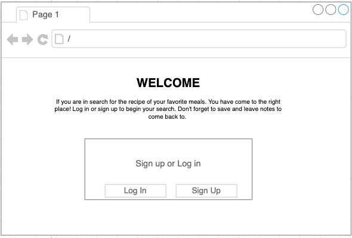
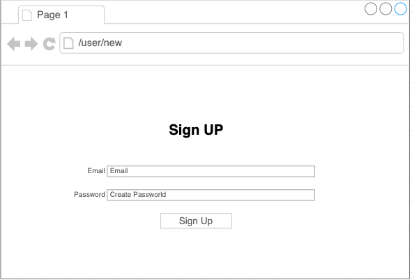
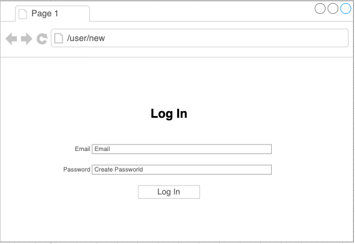
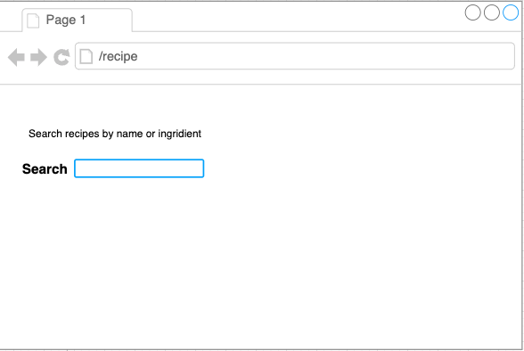
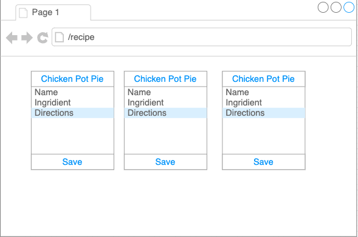
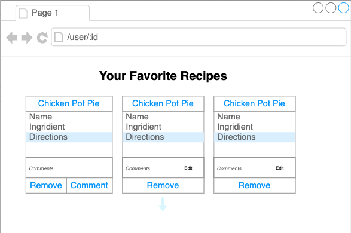
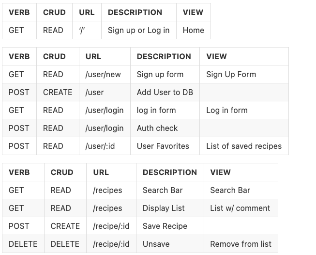
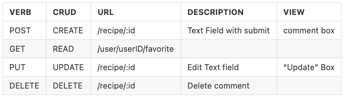

## RECIPE FINDER

## Project Idea and Description

Anthony's Recipe App will allow users to search for their favorite recipes. Signing up for this app will grant users the ability to save thier favorite recipes to a list stored on the app and leave comments for their reference.  

## USER STORIES

As a user, I want to search for recipes so that I can have ideas for a meal

As a user, I want to sign up with my email and password so I can save my favorite recipes

As a user, I want to beable to leave notes on recipes 

# API

https://www.themealdb.com/api.php

## WIREFRAMES

# ERD

# RESTful CHART

# Install Instructions

-use `npm i` to install dependencies. Here is a list of dependencies used for this project:
    bcrypt, cookie-parser, crypto-js, dotenv, ejs, express, pg, sequelize

## MVP GOALS

- Must allow user to login or sign up via a form using secure user authentication methods

- Recipe search should return requested infromation with directions and ingredients 

- User must have the ability to create a list of their favorite recipes

- Add the ability to make notes/comment on recipes

## STRETCH GOALS:

- Add photos from the API for each recipe if available 

- Store more user information by updating table models to sore in DB

- Add a change password/email feature

- Add an original recipe feature where users can store and share their own recipes and renditions
